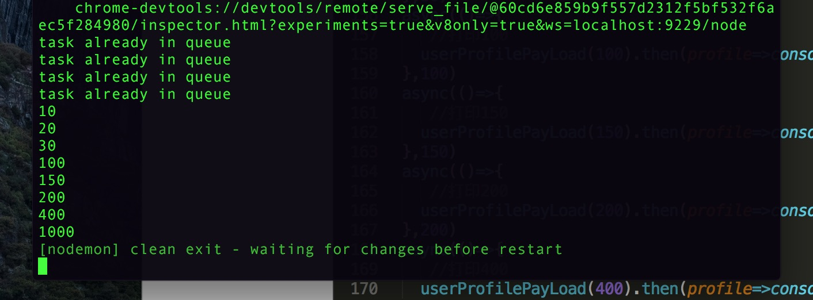

# algorithm-snippet

## 算法列表

- [阿里钉钉面试题之队列变幻](./enqueue.js)



- [对象类型深拷贝](./deep-copy.js)

- [数组排序之冒泡和插入算法](./sort-array.js)

- [二维数组螺旋变幻](./spiral-matrix.js)

## 算法对比

```bash

    # install lodash to make comparison
    npm install

```

